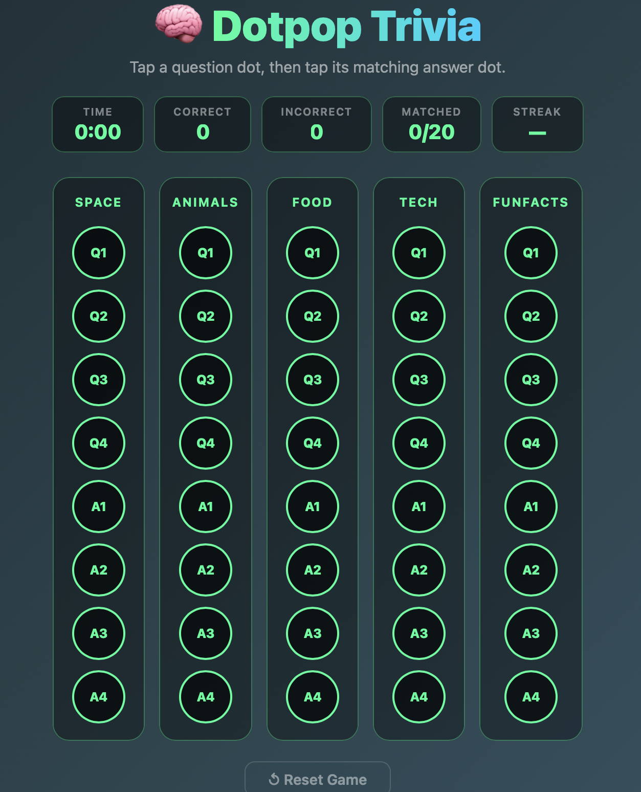

# 🧠 Dotpop Trivia

> **Tap. Match. Learn. Repeat.**

A fast, interactive dot-matching trivia game powered by a simple Q/A structure. Test your knowledge across 5 categories with real-time feedback and streak tracking.

## 🎮 Live Demo

https://teddyeshafer-creator.github.io/dotpop-trivia/

## ✨ Features

- **Total Questions**: 20
- **Categories**: 5
- **Total Matches**: 20 (100 dots)
- **File Size**: ~15KB (HTML + CSS + JS combined)
- **Dependencies**: 0
- **Browser Support**: All modern browsers (Chrome, Firefox, Safari, Edge)